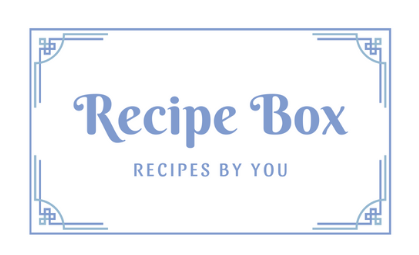

# RecipeBox

## Contributors
- Fatima Bowers id: fzbowers
- Lili Swann id: lvswann
- Katrina Marks id: KatrinaMarks
- Paige King id: PaigeKing

## Website Logo

## Product Description
Recipe Box is a website that allows users to store their favorite recipes.
Users can create sections to organize their recipes, or they can search
for a recipe by its name. Users can also create a shopping list.

## How to view our website
First pull the RecipeBox repo. In the RecipeBox directory, use the following commands:
- source recipe_box/venv/bin/activate
- python recipe_box/manage.py runserver
- copy and paste the given server url to your browser

## How to use our product
This is a relatively self explanatory website; most of the use is intuitive, and 
there are also built in instructions on the website for things like resetting a password.

### For First Time Users:
- Click create account and fill out the form with a username, email, and secure password.
- If you ever forgot your password, clicking reset password and entering your email will send the reset link to your terminal.
- Login with your username and password; this will take you to the homepage.

### The Homepage
- The homepage is where you can access our website's features. 
- Click on new recipe to create a recipe.
- Click on new section to create a section.
- Click on all recipes to see all of your recipes. From here you can click on edit recipe to edit a recipe.
- Click on a section to see all of the recipes in that section. From here you can also edit a recipe.
- Use the search bar to search for a recipe by its name.
- Click on shopping list to access your shopping list.
- Click on account to see your account information, change your information, or logout.

## License
RecipeBox is available under the MIT license. See the [LICENSE](https://github.com/utk-cs340-fall22/RecipeBox/blob/main/LICENSE) for more info.

[def]: WebsiteLogo.png